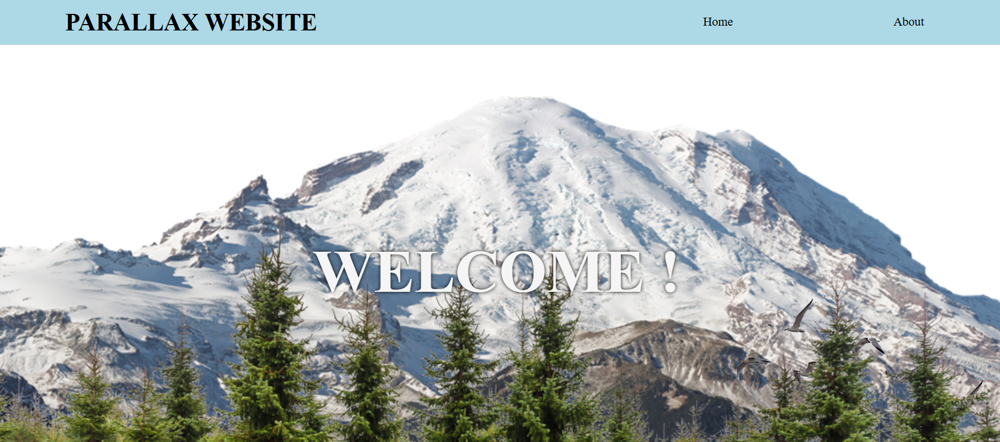

# Parallax Website 🌌

A visually appealing parallax scrolling website built with HTML, CSS, and JavaScript. This project demonstrates the smooth scrolling effect where background elements move slower than the foreground content.

---

## 🛠️ Features

- **Parallax Scrolling Effect**: Smooth scrolling that gives depth to the web experience.

- **Minimal UI with CSS Styling**: Clean, aesthetic look using modern CSS techniques.

--- 

## Demo 📸

---

## 🧰 Technologies Used

- **HTML5**: Markup structure for the website.

- **CSS3**: Styling and layout, including media queries for responsiveness.

- **JavaScript**: For interactivity and smooth scrolling behavior.

--- 

## 📚 Usage

- Customize the parallax sections by modifying the HTML and CSS code.

- Adjust the speed and animation of parallax scrolling in script.js.

